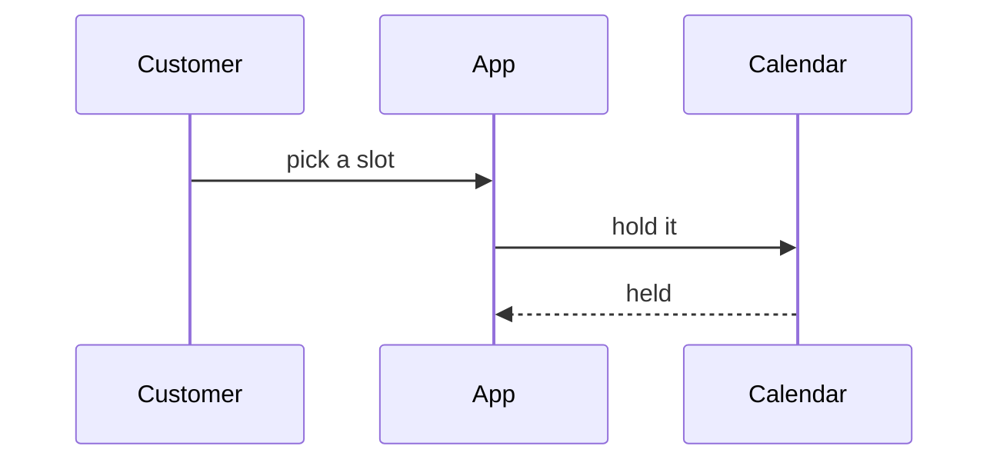

# Visuals

The vocabulary of views a skill reaches for when prose alone will not land. One rule governs
the whole menu: **pick the smallest view that makes the point** — the fewest calls, files,
props, states and boundaries that still answer the question on the table.

## The menu

**Pseudocode** — for logic or an algorithm, stripped of syntax:

```text
on(book)
  if the slot is taken
    reject with the next free slot
  hold the slot
  confirm by mail
```

**Call tree** — for runtime control flow, who calls whom:

```text
handleBooking
  checkAvailability
  holdSlot
    writeHold
  sendConfirmation
```

**Component tree** — for UI structure, with the state and module boundaries that matter:

```text
<BookingPage> (app/booking/page.tsx)
  useAvailability()
  <SlotPicker>
    <SlotButton> (packages/ui)
```

**File tree** — for file responsibility or a broad refactor, kept shallow:

```text
src/
├── booking/      # owns the booking rules
├── calendar/     # reads availability
└── mail/         # sends confirmations
```

**Mermaid** — for interaction, control flow or data flow between parts:



**Diff of the shape** — when the point is what *changes* and the surrounding shape already
exists. Diff whichever view above carries the point — a component tree, a file tree, a call
tree, a state flow — never the raw code when the shape says it faster:

```diff
 handleBooking
   checkAvailability
+  applyCancellationPolicy
   holdSlot
-  sendConfirmation
+  queueConfirmation
```

**The whole block** — when most of it is new, when an omitted line would hide ownership or
order, or when the reader needs a target shape to copy.

**One HTML file** — for a UI, a layout, a side-by-side state comparison, or a concept too dense
for Mermaid: a single self-contained file — a diagram, an infographic, or a short deck. Use the
product's own colours, type and real labels, and make it read on desktop and mobile. Write it
outside the target repo's tracked tree, then open it for the user with whatever the agent can
open a file with; where it can open nothing, give the path.

## Placement

Put each view beside the one short sentence it supports — never a gallery at the end. Reach for
one view, sometimes two; a reply that uses most of the menu has stopped choosing.

## Attribution

The menu and its placement guidance are adapted from **Dex Horthy's `show-me`**
(github.com/humanlayer/skills, MIT), rewritten around a neutral example; the HTML view drops its
`open` command so the vocabulary binds no tool.
